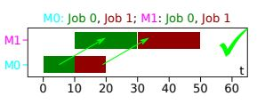

# TP_AdvancedArtificialIntelligence
## Descripción del problema
Los procesadores son capaces de ejecutar millones de operaciones por segundo cuando una computadora les indica; sin embargo, deben realizarlas una a la vez. En este problema veremos una simulación de lo que muchos procesadores representan. Durante un determinado tiempo, realizarán operaciones, cada operación solo podrá ser realizada por un procesador a la vez y tendra un tiempo de ejecución. Los procesadores tendran un  potencia distinta, por lo que el tiempo de ejecución en cada uno, es diferente. El objetivo es maximizar la cantidad de operaciones realizadas en total por todos los procesadores en un determinado tiempo.  
En nuestra simulación, como en un caso de jssp, cada procesador (machine) tendrá asignado sus operaciones (jobs) y lo que demoran en hacer cada una. Usaremos la instancia "yn4" como caso de prueba y será resuelto con random sampling.
## Motivación
El jssp es un método que abarca gran cantidad de problemas en el mundo real. Además, hoy en día todos contamos con computadoras, ya sean capaces de controlar un simple procesador, o, en cierto casos especificos, miles de ellos. Nuestra motivación radica en simular la solución a un problema real y existente. Las computadoras son capaces de conocer a qué procesador les conviene mandar una orden específica paara que se puedan realizar la mayor cantidad de operaciones posible en menos tiempo.
## Espacio de Solución
Nuestro espacio de solución no varía de uno de jssp común. Sin embargo, nuestro objetivo es diferente, ya que tendremos un tiempo (makespan) límite, y buscamos realizar la mayor cantidad de operaciones posibles.
### Ejemplo
Para una instancia como esta:\
2 2 \
0 10 1 10 \
0 10 1 20 \
y con un tiempo de ejecución máximo de 50 ms, esta podría ser una solución: \
 \
Se puede observar que en este caso se ralizaron 4 operaciones en total, maximizando lo que se busca. Recordemos que aunque se pueda hacer en menos tiempo, no nos interesa en este problema. Nuestro único objetivo es lograr terminar la mayor cantidad de operaciones en un tiempo concreto.
## Espacio de búsqueda
Así como en el jssp, este problema tine restricciones. Y no todas las "soluciones" estarán conrrectas.
### Ejemplo
Tomemos el caso del espacio de solución: \ 
2 2 \
0 10 1 10 \
0 10 1 20 \
También con un tiempo máximo de 60 ms. \
 \
Esta "Solución" no es correcta, ya que nos pasamos del tiempo indicado.

